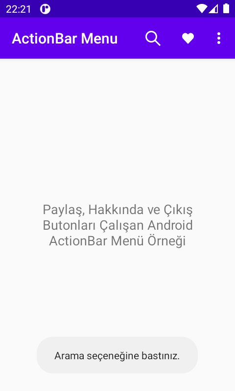
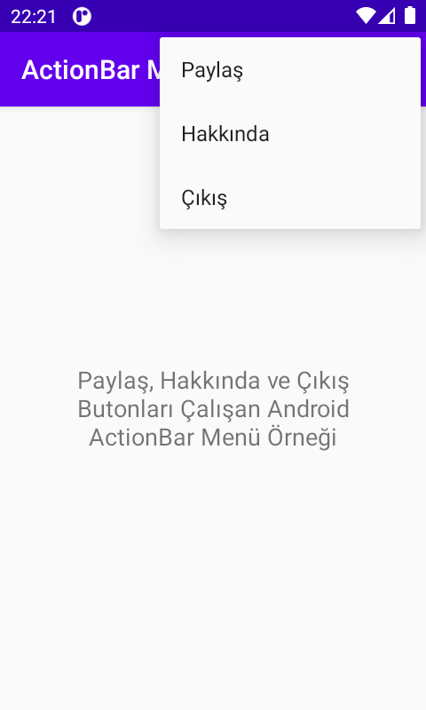

# Ekran Görüntüleri

     

---

# Android ActionBar Menü Oluşturma ve Öge Ekleme

Bu yazımda Android ActionBar’da menü oluşturmayı, bu menüye öge eklemeyip ve düzenlemeyi, eklediğimiz ögelere özellikler kazandırmayı ve bu ögelere dışarıdan ikon alıp tanımlamayı anlatacağım.

Projenin kaynak kodlarını Github hesabımda bulabilirsiniz.

İlk olarak menüyü oluşturmak için gerekli olan klasör ve dosyaları proje dizinimizde oluşturalım.

Menü klasörümüzü oluşturalım.

Android Studio’da sol kısımda proje klasörlerimiz gözükmektedir. res klasörümüze sağ tık yapalım ardından New > Android Resource Directory seçeneğini seçelim.


Karşımıza gelen pencerede Resource type kısmından menu seçeneğini seçelim. Sadece klasör adını menu yapmamızda işimizi görecekti ama böyle seçmemiz daha doğru olur. Ardından OK butonuna tıklayalım.


Sol kısımda res’in altında menu adında bir klasör olduğunu göreceksiniz.

Şimdi oluşturduğumuz bu menu klasörünün içine bir dosya oluşturalım. menu klasörüne sağ tık yapalım ve açılan menüden New > Menu Resource File seçeneğini seçelim.


Karşımıza çıkan pencerede File Name kısmına menu yazalım ve ardından OK butonuna basalım.


Sol taraftan menu klasörümüzün altında menu.xml adında bir dosya oluştuğunu göreceksiniz. Bu dosya otomatik olarak açılacaktı açılmaz ise sol kısımdan dosyaya çift tıklayıp açabiliriz. Desing modunda açılırsa sağ üstten Code yazısına basarak kod moduna geçelim.

Bu dosyanın içerisine menu kodlarını yazmaya başayabiliriz.

menu.xml dosyamızın içi:

```java
<?xml version="1.0" encoding="utf-8"?>
<menu xmlns:android="http://schemas.android.com/apk/res/android">

    <item
        android:id="@+id/ara"
        android:title="Ara"/>

    <item
        android:id="@+id/begen"
        android:title="Beğen"/>

    <item
        android:id="@+id/paylas"
        android:title="Paylaş"/>

    <item
        android:id="@+id/hakkinda"
        android:title="Hakkında"/>

    <item
        android:id="@+id/cikis"
        android:title="Çıkış"/>

</menu>
```

Bu kodlar ile 5 tane öge oluşturduk.

Şimdi MainActivity.java dosaysına dönüp menü için java kodlarımızı yazmaya başlayalım. MainActivity.java dosaysının içinde

```java
@Override
    protected void onCreate(Bundle savedInstanceState) {
        super.onCreate(savedInstanceState);
        setContentView(R.layout.activity_main);
    }
```

kodunun hemen altına aşağıdaki kodları yazalım:

```java
    @Override
    public boolean onCreateOptionsMenu(Menu menu) {
        getMenuInflater().inflate(R.menu.menu,menu);
        return super.onCreateOptionsMenu(menu);
    }

    @Override
    public boolean onOptionsItemSelected(@NonNull MenuItem item) {
        int id =item.getItemId();
        switch (id){
            case R.id.ara:
                Toast.makeText(this, "Arama seçeneğine bastınız.", Toast.LENGTH_SHORT).show();
                break;
            case R.id.begen:
                Toast.makeText(this, "Beğenme seçeneğine bastınız.", Toast.LENGTH_SHORT).show();
                break;
            case R.id.paylas:
                Toast.makeText(this, "Paylaşma seçeneğine bastınız.", Toast.LENGTH_SHORT).show();
                break;
            case R.id.hakkinda:
                Toast.makeText(this, "Hakkında seçeneğine bastınız.", Toast.LENGTH_SHORT).show();
                break;
            case R.id.cikis:
                Toast.makeText(this, "Çıkış seçeneğine bastınız.", Toast.LENGTH_SHORT).show();
                break;
        }
        return super.onOptionsItemSelected(item);
    }
```

Kırmızı yazan yazıların hepsinin üzerine sırasıyla bir kez tıklayıp alt+enter yaparsan o koda ait kütüphaneyi projemize import ederek kodun çalışmasını sağlayalım. Aksi taktirde çalışmayacaktır. Basıldığında Toast kodunun bulunduğu satıra yazdığımız kodlar çalıştıracaktır. Örnekte Toast kullanmamızın sebebi butona bastığımızda Toast kodunun içindeki yazının ekrana yazması ve böylece kodların doğru çalışıp çalışmadığımızı test etmek içindir. Toast kodunu silip istediğiniz kodu yazabilirsiniz. Çıkış yaptıran yada paylaştıran kodlar gibi.

Üstte yazdığımız MainActivity.java dosyasının komple içi alt+enter yaparak import ettiğimiz kütüphaneler ile birlikte böyle olmalı:

```java
package com.PAKET ADINIZI BURAYA YAZIN.actionbarmenuexample;

import androidx.annotation.NonNull;
import androidx.appcompat.app.AppCompatActivity;

import android.os.Bundle;
import android.view.Menu;
import android.view.MenuItem;
import android.widget.Toast;

public class MainActivity extends AppCompatActivity {

    @Override
    protected void onCreate(Bundle savedInstanceState) {
        super.onCreate(savedInstanceState);
        setContentView(R.layout.activity_main);
    }

    @Override
    public boolean onCreateOptionsMenu(Menu menu) {
        getMenuInflater().inflate(R.menu.menu,menu);
        return super.onCreateOptionsMenu(menu);
    }

    @Override
    public boolean onOptionsItemSelected(@NonNull MenuItem item) {
        int id =item.getItemId();
        switch (id){
            case R.id.ara:
                Toast.makeText(this, "Arama seçeneğine bastınız.", Toast.LENGTH_SHORT).show();
                break;
            case R.id.begen:
                Toast.makeText(this, "Beğenme seçeneğine bastınız.", Toast.LENGTH_SHORT).show();
                break;
            case R.id.paylas:
                Toast.makeText(this, "Paylaşma seçeneğine bastınız.", Toast.LENGTH_SHORT).show();
                break;
            case R.id.hakkinda:
                Toast.makeText(this, "Hakkında seçeneğine bastınız.", Toast.LENGTH_SHORT).show();
                break;
            case R.id.cikis:
                Toast.makeText(this, "Çıkış seçeneğine bastınız.", Toast.LENGTH_SHORT).show();
                break;
        }
        return super.onOptionsItemSelected(item);
    }

}
```

Şimdi projemizi sanal cihazımızda çalıştırıp test edelim.


Menümüz çalışıyor. Şimdi sıra geldi menümüzün tasarımına.

res klasörü içerisinde bulunan menu.xml dosyamızı açalım. Kodlar ile tasarım yapacağız ve bu tasarımı da direk görmek için sağ üstten “Split” seçeneğini seçelim.

Menülerin sırasını belirtelim. Eğer özel bir sıra belirten kod yazmazsanız menü sırası koddaki sıraya göre olacaktır ama aşağıdaki örnekteki gibi

```java
android:orderInCategory="0"
```

kodunu kullanırsanız 0 yazan yere sırasıyla 0, 1, 2, … gibi sayılar vererek tasarımdaki menü sırasını değiştirebilirsiniz.

menu.xml dosyasının içini aşağıdaki gibi değiştirirsek

```java
<?xml version="1.0" encoding="utf-8"?>
<menu xmlns:android="http://schemas.android.com/apk/res/android">

    <item
        android:orderInCategory="0"
        android:id="@+id/ara"
        android:title="Ara"/>

    <item
        android:orderInCategory="1"
        android:id="@+id/begen"
        android:title="Beğen"/>

    <item
        android:orderInCategory="3"
        android:id="@+id/paylas"
        android:title="Paylaş"/>

    <item
        android:orderInCategory="5"
        android:id="@+id/hakkinda"
        android:title="Hakkında"/>

    <item
        android:orderInCategory="4"
        android:id="@+id/cikis"
        android:title="Çıkış"/>

</menu>
```

Sıralama sırasıyla Ara – Beğen – Paylaş – Çıkış – Hakkında şeklinde olacaktır.


Ama ben eski sırasına dönmesi için yukarıdan aşağıya sırasıyla 0, 1, 2, 3, 4 yazacağım.

Sıralama işlemi de bu kadardı.

Şimdi hangi ögelerin açık şekilde ActionBar’da gözükeceğini ve hangi ögelerin 3 noktanın içerisinde açılır menüde gözükeceğini belirtelim. Bu işlemde showAsAction kullanacağız. Kodu eklediğimizde başındaki appyazısı kırmızı yanacaktır. Çalışması için app yazısına bir kere tıklayıp alt+enter yapalım.

```java
app:showAsAction="always" //Her ekran boyutunda ActionBar'da gözükecektir.
app:showAsAction="never" //3 noktanın altında açılır menüde gösterecektir.
app:showAsAction="ifroom" //ActionBar'da yer varsa gösterir. Sığmıyorsa 3 noktanın altında açılır menüde gösterecektir.
```

İlk 2 ögemizin kodlarına, her zaman ActionBar’da açık şekilde gözüksün diye

```java
app:showAsAction="always"
```

kodunu ekleyelim.

Diğer öğelerimiz ise her zaman 3 noktanın altında açılır menüde gözüksün diye de

```java
app:showAsAction="never"
```

kodunu ekleyelim.

menu.xml dosyamızın içi:

```java
<?xml version="1.0" encoding="utf-8"?>
<menu xmlns:app="http://schemas.android.com/apk/res-auto"
    xmlns:android="http://schemas.android.com/apk/res/android">

    <item
        android:id="@+id/ara"
        app:showAsAction="always"
        android:icon="@drawable/search"
        android:orderInCategory="0"
        android:title="Ara" />

    <item
        android:orderInCategory="1"
        app:showAsAction="always"
        android:id="@+id/begen"
        android:title="Beğen"/>

    <item
        android:orderInCategory="2"
        app:showAsAction="never"
        android:id="@+id/paylas"
        android:title="Paylaş"/>

    <item
        android:orderInCategory="3"
        app:showAsAction="never"
        android:id="@+id/hakkinda"
        android:title="Hakkında"/>

    <item
        android:orderInCategory="4"
        app:showAsAction="never"
        android:id="@+id/cikis"
        android:title="Çıkış"/>

</menu>
```

Artık her zaman Ara ve Beğen seçenekleri ActionBar’da, diğer seçenekler ise açılır menüde gösterilecektir.

Şimdi ActionBar’da görünen ögeler yazı olarak değil de resim olarak gözükmesini ayarlayalım.

Sağdaki tasarımdan menüye bir kez tıklayalım ve sağ kısımdan icon satırında bulunan resim simgesine tıklayalım.

Açılan pencereden projemizin içinde önceden yüklü olan vektörleri seçip direk kullanabiliriz ama dışarıdan projemizin içine bir vektör alıp kullanacaksak sol üstte bulunan + simgesine basalım ve Import Drawables seçeneğini seçelim. Açılan klasör gezgininden de vektör ikonumuzu seçelim. Arama motoruna free icon yazarak telifsiz ve ücretsiz şekilde icon veren siteler bulabiliriz. SVG formatında indirmeyi de unutmayın. SVG formatı xml biçiminde kodlandığı için resim formatlarına göre bir boyutu yoktur her boyuta göre istenilen kadar küçültülüp büyültülebilir ayrıca yine xml biçiminde olduğundan dosya boyutu da resim dosyalarının boyutuna göre daha düşüktür. Ve istediğimiz zaman bir kod editörü ile SVG dosyasının kodlarını açıp içerisinden renk kodlarını değiştirerek SVG ikonumuzun renklerini de değiştirebiliriz. Bu yüzden her zaman SVG formatında ikon kullanalım.


Eğer indirdiğiniz .svg uzantılı dosyayı göremiyorsanız klasörün önündeki oka tıklayarak klasörü bir kaç kez küçültüp tekrar açarsanız dosya görünecektir. İkonumuzu seçtikten sonra OK butonuna basalım. Karşımıza gelen pencerede Next butonuna basalım.


Daha sonra karşımıza gelen pencereden Import butonuna basalım.


Bastıktan sonra artık ikonumuz projemizin içine eklenmiş olur. İkonumuzu artık diğer ikonların yanında her zaman göreceğiz ve seçip kullanabileceğiz. Pencereden yüklediğimiz ikonumuzu seçelim ve OK butonuna basalım.

Artık ikonumuz res > drawable klasörünün içerisine eklendi ve Android Studio tarafından menümüzde ki ögemizin kodlarının arasına

```java
android:icon="@drawable/search"
```

kodu otomatik olarak eklenerek ikonumuz ögemizin yerinde gösterildi.


Uygulamamızı sanal cihazda çalıştırdığımızda cihazımızın ekran boyutu küçük olduğu için ve uygulamanın adı da çok uzun olduğu için ikonumuz gözükür ama uygulama adımızın bir kısmı ActionBar M… şeklinde gözükür bu yüzden uygulamamızın adından Menu Example yazısını silerek kısaltalım. Uygulamanın adını değiştirmek için solda bulunan dosya gezgininden res > values klasörünün içinde bulunan strings.xml dosyasına çift tıklayarak açalım ve içindeki uygulama adımızı değiştirelim.


Hazır strings.xml dosyasını açmışken projedeki tüm xml dosyalarındaki yazıları (tittle) bu dosyaya ekleyerek daha düzenli bir uygulama yapalım. Nasıl yaptığımı öğrenmek için bu yazıma bakabilirsiniz:

strings.xml Dosyasının Kullanımı – Android Uygulamasının Adını Değiştirme

Özetle menü oluşturduk, öge ekledik, bazı ögeleri ActionBar’da gösterdik, ögeye icon yükledik, ögelerin title’larını strings.xml’e verip id ile oradan çektik.


Şimdi eklediğimiz büyüteç ikonunun rengini beyaz yapalım.

Sol tarafta bulunan dosya gezgininden res > drawable klasörünün içinde bulunan search.xml dosyasını çift tıklayarak açalım. Renk kodunun olduğu satırın başında bulunan kare renk kutusuna tıklayalım ve açılan renk paletinden beyaz rengini seçelim. Eğer Android Studio’yu güç tasarruf modunda kullanıyorsak renk kodunun olduğu satırın önünde kare renk kutusu olmayacaktır bunun yerine # ile başlayan ve 6 karakter olan HEX renk kodunu, beyaz HEX renk kodu olan #FFFFFF ile değiştirebiliriz.


Artık ikonumuzun yeni rengi ayarlandı.

Aynı şekilde beğen ödesine de bir kalp icon’u koyup rengini beyaz olarak ayarlayalım.

Şimdi Paylaş, Hakkında, ve Çıkış butonlarına özeliklerini kazandıralım.

MainActivity.java dosyamıza dönelim ve aşağıdaki yazan kodların bulunduğu satıra gelelim.

```java
    @Override
    public boolean onCreateOptionsMenu(Menu menu) {
        getMenuInflater().inflate(R.menu.menu,menu);
        return super.onCreateOptionsMenu(menu);
    }

    @Override
    public boolean onOptionsItemSelected(@NonNull MenuItem item) {
        int id =item.getItemId();
        switch (id){
            case R.id.ara:
                Toast.makeText(this, "Arama seçeneğine bastınız.", Toast.LENGTH_SHORT).show();
                break;
            case R.id.begen:
                Toast.makeText(this, "Beğenme seçeneğine bastınız.", Toast.LENGTH_SHORT).show();
                break;
            case R.id.paylas:
                Toast.makeText(this, "Paylaşma seçeneğine bastınız.", Toast.LENGTH_SHORT).show();
                break;
            case R.id.hakkinda:
                Toast.makeText(this, "Hakkında seçeneğine bastınız.", Toast.LENGTH_SHORT).show();
                break;
            case R.id.cikis:
                Toast.makeText(this, "Çıkış seçeneğine bastınız.", Toast.LENGTH_SHORT).show();
                break;
        }
        return super.onOptionsItemSelected(item);
    }
```

---

Önce Paylaş butonuna özellik kazandıralım. Bunun için case R.id.paylas: ve break; satırları arasında bulunan Toast kodunun olduğu satırı silelim ve yerine paylaşma işine yarayan kodlarımızı yazalım.

2 çeşit paylaşma kodu var. İşimize hangisi yarayacaksa onu seçelim. Ben ikinci kodu yani Çok satırlı yazı paylaşan paylaşma kodunu kullanacağım.

Kodları ekledikten sonra kırmızı yanan yazılara bir kere tıklayıp alt+enter yapalım ve açılan seçeneklerden en üstteki seçeneği seçerek kodun çalışması için gerekli sınıfı projemize import edelim.

Tek satır yazı paylaşan paylaşma kodu

```java
Intent sendIntent = new Intent();
sendIntent.setAction(Intent.ACTION_SEND);
sendIntent.putExtra(Intent.EXTRA_TEXT, "Bu tek satırlı yazı paylaşma kodudur.");
sendIntent.setType("text/plain");
startActivity(Intent.createChooser(sendIntent, "Paylaş"));
```

Çok satırlı yazı paylaşan paylaşma kodu

```java
Intent sendIntent = new Intent();
sendIntent.setAction(Intent.ACTION_SEND);
sendIntent.putExtra(android.content.Intent.EXTRA_TEXT,
"Bu çok satırlı yazı \n" +
"paylaşma kodudur. \n");
sendIntent.setType("text/plain");
startActivity(Intent.createChooser(sendIntent, "Paylaş"));
```

Yukarıda ki kodda kullanılar “\n” java dilinde bir alt satıra geçmemize yarıyor. HTML için kullanılan <br> ile aynı.

---

Şimdi Hakkında butonuna özellik kazandıralım. Bu işlemde isterseniz hakkında için bir layot sayfası oluşturarak bu sayfaya geçiş yapan intent kodlarını kullanabilirsiniz. Bu yolu seçecekseniz aşağıdaki intent ile sayfalar arası geçiş yazıma bakın.

Android Intent Kullanımı – Sayfalar Arası Geçiş İşlemi

Ama ben daha kolay olan AlertDialog pencesinde hakkında yazılarını göstermek istiyorum. Alt kısmada AlertDialog pencesini kapatan “Geri” seçeneği ekleyeceğim. “Geri” seçeneği seçildiğinde dialogInterface.cancel(); kodu çalışarak AlertDialog pencesini kapatacak.

Bu AlertDialog’u eklemek için kodlarımız içindeki case R.id.hakkinda: ve break; satırları arasında bulunan Toast kodunun olduğu satırı silelim ve yerine AlertDialog pencesini açan aşağıdaki kodları yazalım.

Kodları ekledikten sonra kırmızı yanan yazılara bir kere tıklayıp alt+enter yapalım ve açılan seçeneklerden en üstteki seçeneği seçerek kodun çalışması için gerekli sınıfı projemize import edelim.

```java
final AlertDialog.Builder hakkindapenceresi = new AlertDialog.Builder( MainActivity.this ); //hakkindapenceresi adında AlertDialog tanımladık
                hakkindapenceresi.setTitle("Hakkında"); //AlertDialog penceresi başlığı
                hakkindapenceresi.setMessage( "Bu uygulama \ngithub.com/emrecagri \ntarafından hazırlanmıştır." );         //AlertDialog penceresi açıklaması
                hakkindapenceresi.setCancelable( true ); //true ile bu AlertDialog penceresinden seçeneklere basılmadan çıkış yapılabileceğini belirttik
                hakkindapenceresi.setPositiveButton( "Geri", new DialogInterface.OnClickListener() { //AlertDialog Pozitif Geri seçeneği
                    @Override
                    public void onClick(DialogInterface dialogInterface, int i) {
                        dialogInterface.cancel(); // Geri seçeneği seçildiğinde bu kod çalışıp AlertDialog penceresini kapatacak
                    }
                });
                AlertDialog hakkindapenceresiAlertDialogu = hakkindapenceresi.create();
                hakkindapenceresiAlertDialogu.show(); // AlertDialog penceresini gösteren kod
```

---

Şimdi Çıkış butonuna özellik kazandıralım. Basıldığında direk çıkış yapmasını isterseniz case R.id.cikis: satırının altındaki Toast kodunu silip yerine

```java
finish();
```

yazmanız yeterli olacaktır. Ama ben yanlışlıkla basılmayı önlemek için basıldığında önce bir AlertDialog pencesinde “Uygulamadan çıkmak istediğinize emin misiniz?” diye soru sordurtacağım. Altına da “Evet” ve “Hayır” seçeneklerini koyacağım. “Evet” seçeneği seçildiğinde finish(); kodu çalışarak uygulama kapanacak. “Hayır” seçeneği seçildiğinde dialogInterface.cancel(); kodu çalışarak AlertDialog pencesini kapatacak.

Bu AlertDialog’u eklemek için kodlarımız içindeki case R.id.cikis: ve break; satırları arasında bulunan Toast kodunun olduğu satırı silelim ve yerine AlertDialog pencesini açan aşağıdaki kodları yazalım.

Kodları ekledikten sonra kırmızı yanan yazılara bir kere tıklayıp alt+enter yapalım ve açılan seçeneklerden en üstteki seçeneği seçerek kodun çalışması için gerekli sınıfı projemize import edelim.

```java
final AlertDialog.Builder cikispenceresi = new AlertDialog.Builder( MainActivity.this ); //cikispenceresi adında AlertDialog tanımladık
                cikispenceresi.setMessage( "Uygulamadan çıkmak istediğinize emin misiniz?" );         //AlertDialog penceresi açıklaması
                cikispenceresi.setCancelable( true );  //true ile bu AlertDialog penceresinden seçeneklere basılmadan çıkış yapılabileceğini belirttik
                cikispenceresi.setNegativeButton( "Hayır",new DialogInterface.OnClickListener() { //AlertDialog Negatif Hayır seçeneği
                    @Override
                    public void onClick(DialogInterface dialogInterface, int i) {
                        dialogInterface.cancel(); // Hayır seçeneği seçildiğinde bu kod çalışıp AlertDialog penceresini kapatacak
                    }
                });
                cikispenceresi.setPositiveButton( "Evet", new DialogInterface.OnClickListener() { //AlertDialog Pozitif Evet seçeneği
                    @Override
                    public void onClick(DialogInterface dialogInterface, int i) {
                        finish();   // Evet seçeneği seçildiğinde bu kod çalışıp uygulamayı kapatacak
                    }
                });
                AlertDialog cikispenceresiAlertDialogu = cikispenceresi.create();
                cikispenceresiAlertDialogu.show(); // AlertDialog penceresini gösteren kod
```

İşlemimiz bu kadar. Artık bu 3 butonumuzda görevlerini yerine getiriyorlar.
